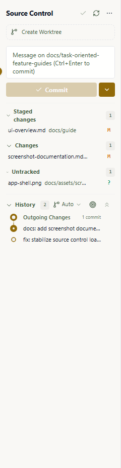

# Screenshot Documentation

Use this guide when adding reader-facing screenshots to Wardian documentation.

## Directory Layout

Committed screenshots live under:

```text
docs/assets/screenshots/<feature-or-window>/<state>.png
```

Use kebab-case for folders and filenames. Match the folder to the feature guide that owns the screenshot:

- `docs/assets/screenshots/grid/`
- `docs/assets/screenshots/dashboard/`
- `docs/assets/screenshots/explorer/`
- `docs/assets/screenshots/spawn-agent/`
- `docs/assets/screenshots/command-panel/`
- `docs/assets/screenshots/watchlists/`
- `docs/assets/screenshots/library/`
- `docs/assets/screenshots/automations/`
- `docs/assets/screenshots/source-control/`
- `docs/assets/screenshots/settings/`
- `docs/assets/screenshots/user-terminal/`

Do not place committed documentation images under `e2e/screenshots/`. That directory is ignored and reserved for local PR evidence, rendering audits, and temporary Playwright captures.

## Embedding

Embed screenshots from the guide or reference page that explains the feature:

```md

```

Use alt text that describes the visible state. Avoid vague labels such as `Screenshot of Source Control`.

## Capture Rules

- Capture real Wardian UI with seeded or sanitized data.
- Keep screenshots feature-specific. Avoid generic empty-window captures.
- Hide or avoid local usernames, absolute paths, API keys, provider tokens, and private repository names.
- For PR visual evidence, prefer a 1920x1080 desktop viewport or native window so the screenshot resembles a normal fullscreen desktop.
- Use smaller viewports, cropped regions, or component screenshots only when the screenshot is deliberately proving responsive behavior, cramped layout, resize behavior, or a specific detail that would be harder to see fullscreen.
- Prefer PNG for UI screenshots.
- Compress large images before committing.
- Refresh screenshots in the same PR when a visual change makes existing documentation images stale.

## Recommended Automation

Start the app with an isolated home so screenshots are reproducible.

```bash
WARDIAN_HOME="$(mktemp -d)" npm run dev
```

PowerShell:

```powershell
$env:WARDIAN_HOME = "$PWD\.tmp\wardian-docs-screenshots"
npm run dev
```

Capture with Playwright or a browser screenshot tool, then copy only curated images into `docs/assets/screenshots/<feature-or-window>/`.

The first-pass core feature screenshots can be refreshed with:

```bash
npm run docs:screenshots
```

For screenshots that require Tauri IPC, PTY behavior, or provider runtime behavior, use the native E2E harness instead of browser-only E2E.

## PR Evidence Upload (CLI)

Temporary PR evidence belongs in `e2e/screenshots/<feature>/<timestamp>/` and must remain untracked. Use the installed `gh attach` extension with its token-backed `release-asset` strategy. It returns GitHub-ready Markdown with an HTTPS image URL.

Do not use browser automation, browser-session cookies, or the `repo-branch` strategy for normal PR evidence. The `release-asset` strategy uses the authenticated `gh` token and keeps temporary screenshots out of the branch.

### New PR (preferred)

Every Wardian PR must already link an issue. Upload against that issue before opening the PR, then place the emitted Markdown below the PR template's `## Screenshots` heading. This prevents the initial screenshot-gate job from seeing a body without evidence. Prepare the complete PR template body in the untracked `.tmp/pr-body.md` file before running the final two commands.

macOS/Linux shell:

```bash
issue=123
repo="$(gh repo view --json nameWithOwner --jq .nameWithOwner)"
evidence="$(gh attach upload \
  e2e/screenshots/<feature>/<timestamp>/<state>.png \
  --target "$repo#$issue" \
  --strategy release-asset \
  --format markdown)"
printf '\n\n## Screenshots\n\n%s\n' "$evidence" >> .tmp/pr-body.md
gh pr create --base main --head <branch> --title '<title>' --body-file .tmp/pr-body.md
```

PowerShell:

```powershell
$issue = 123
$repo = gh repo view --json nameWithOwner --jq .nameWithOwner
$evidence = [string]::Join("`n", @(gh attach upload `
  'e2e/screenshots/<feature>/<timestamp>/<state>.png' `
  --target "$repo#$issue" `
  --strategy release-asset `
  --format markdown))
Add-Content -LiteralPath '.tmp/pr-body.md' -Value "`n`n## Screenshots`n`n$evidence"
gh pr create --base main --head '<branch>' --title '<title>' --body-file '.tmp/pr-body.md'
```

### Existing PR recovery

If a PR already exists, target its number and append the returned Markdown with `gh pr edit`:

```bash
pr=123
repo="$(gh repo view --json nameWithOwner --jq .nameWithOwner)"
evidence="$(gh attach upload e2e/screenshots/<feature>/<timestamp>/<state>.png \
  --target "$repo#$pr" --strategy release-asset --format markdown)"
body="$(printf '%s\n\n## Screenshots\n\n%s\n' \
  "$(gh pr view "$pr" --json body --jq .body)" "$evidence")"
gh pr edit "$pr" --body "$body"
PR_BODY="$(gh pr view "$pr" --json body --jq .body)" \
  npm run check:frontend-screenshot origin/main HEAD
```

PowerShell:

```powershell
$pr = 123
$repo = gh repo view --json nameWithOwner --jq .nameWithOwner
$evidence = [string]::Join("`n", @(gh attach upload `
  'e2e/screenshots/<feature>/<timestamp>/<state>.png' `
  --target "$repo#$pr" `
  --strategy release-asset `
  --format markdown))
$currentBody = [string]::Join("`n", @(gh pr view $pr --json body --jq .body))
gh pr edit $pr --body "$currentBody`n`n## Screenshots`n`n$evidence"
$env:PR_BODY = [string]::Join("`n", @(gh pr view $pr --json body --jq .body))
npm run check:frontend-screenshot origin/main HEAD
```

For more than one image, provide each file to the same `gh attach upload` command. Ensure the returned Markdown is under the PR's `## Screenshots` heading and do not add `e2e/screenshots/` to the commit.

## Review Checklist

- The image belongs under `docs/assets/screenshots/`, not `e2e/screenshots/`.
- The filename and directory are kebab-case.
- The image is embedded from the owning guide page.
- The surrounding text explains the state shown in the image.
- The alt text is descriptive.
- No local paths, secrets, or private data are visible.
- `git status` shows only intended docs assets and guide updates.
- Temporary PR evidence was uploaded with `gh attach` and is not staged or committed.

Use [Core Feature Screenshot Capture Plan](./screenshot-capture-plan.md) to decide which screenshots belong in the first documentation pass.

The internal core feature screenshot documentation spec records the architectural decision.
