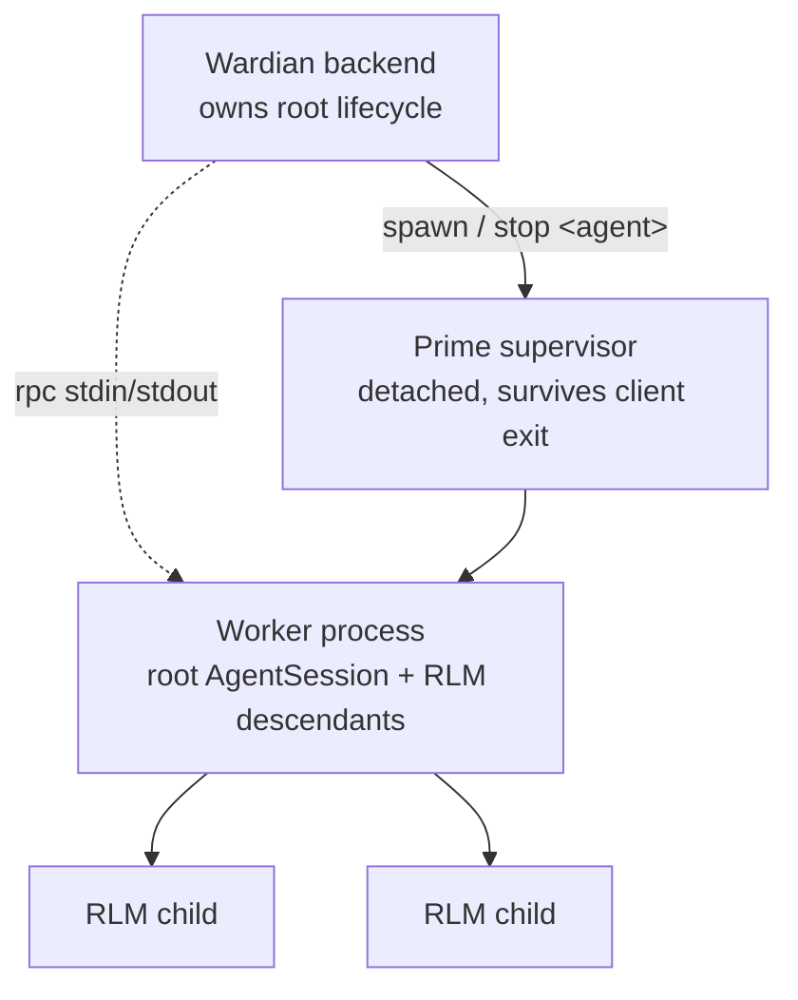

# Prime Agent Provider

- **Status:** Proposed
- **Date:** 2026-08-05

## Problem

Wardian supports five agent CLIs (Claude, Codex, Gemini, Antigravity, OpenCode).
All five share two properties that shape the current provider layer:

1. They are driven interactively by writing keystrokes into a PTY, so every
   provider needs a hand-tuned `DeliveryProfile` (submit key, bracketed-paste
   threshold, settle delay, input-ready and busy markers).
2. The agent process dies with its PTY, so PTY liveness is a valid proxy for
   agent liveness.

[Prime Agent](https://github.com/PrimeIntellect-ai/prime-agent) violates both.
It exposes a bidirectional JSONL command channel (`--mode rpc`) that replaces
keystroke emulation entirely, and it runs each root session tree in a detached
daemon worker that survives client disconnect. It is also the first candidate
provider with first-class recursive subagents, which Wardian currently has no
way to display.

Adding it therefore is not only a new `AgentProvider` implementation. It
requires a lifecycle shape the provider layer has not needed before, and it
opens a nested-agent surface the UI has never had a provider able to populate.

This spec defines the provider contract, the lifecycle changes, and the depth
of feature combination, in landable phases.

## Background: what Prime Agent is

An MIT-licensed fork of `earendil-works/pi` (pi-mono). A TypeScript host drives
a persistent IPython kernel, which is the **only** model-facing tool. File
operations, shell commands, skills, MCP integrations, and subagent delegation
all happen as Python inside that kernel.

Relevant properties, from `packages/coding-agent/docs/` in the upstream repo:

| Property | Detail |
|---|---|
| Meta-provider | Selects its own backend: anthropic, openai, google, bedrock, vertex, azure, mistral, cloudflare, copilot |
| Modes | interactive TUI, `-p/--print`, `--mode json`, `--mode rpc` |
| Sessions | Flat append-only JSONL under `~/.prime/agent/sessions/`, overridable with `--session-dir` |
| Context files | Native `AGENTS.md`; also reads `CLAUDE.md`; global at `~/.prime/agent/AGENTS.md` |
| Subagents | `await rlm(...)` inside the kernel; each child gets its own model, kernel, and session tree |
| Daemon | Detached supervisor, one worker process per root session tree; workers outlive clients |
| A2A | Sessions message each other, restricted to parent/sibling/child within one root tree |
| Config dir | `~/.prime/agent`, overridable with `PRIME_AGENT_CODING_AGENT_DIR` |
| Windows | Requires bash; probes `~/.prime/agent/settings.json` → `C:\Program Files\Git\bin\bash.exe` → PATH |
| Runtime dep | Bootstraps an IPython kernel venv at `~/.prime/agent/kernel-venv`, or uses `PRIME_AGENT_KERNEL_PYTHON` |

Prime Agent has no permission-prompt or sandbox layer; it executes
model-generated Python with the user's permissions. This matches the existing
OpenCode precedent, where `OpenCodeProviderConfig` also carries no safety
knobs. It is a property of the provider the user selects, not a gap Wardian
needs to close.

## Decision

### Provider identity

Provider id `prime`, display name `Prime Agent`, instruction file `AGENTS.md`.

`prime` is a meta-provider: `AgentConfig.model` carries a composite
`provider/model[:thinking]` value (for example `anthropic/claude-opus-5:high`)
rather than a bare model id. The model catalog must preserve that composite in
`ProviderModelOption.id`.

### Data schema

Add to `crates/wardian-core/src/models/agent_config.rs`:

```rust
#[derive(Debug, Clone, PartialEq, Eq, Serialize, Deserialize, Default)]
#[serde(default)]
pub struct PrimeProviderConfig {
    /// off | minimal | low | medium | high | xhigh | max
    #[serde(skip_serializing_if = "Option::is_none")]
    pub thinking: Option<String>,
    /// Allowlist for `--tools`; `ipython` is the only built-in.
    #[serde(skip_serializing_if = "Option::is_none")]
    pub tools: Option<Vec<String>>,
    #[serde(skip_serializing_if = "Option::is_none")]
    pub no_builtin_tools: Option<bool>,
    /// Repeatable `-e/--extension` sources (path, npm, or git).
    #[serde(skip_serializing_if = "Option::is_none")]
    pub extensions: Option<Vec<String>>,
    /// Repeatable `--skill` paths, beyond habitat discovery.
    #[serde(skip_serializing_if = "Option::is_none")]
    pub skills: Option<Vec<String>>,
    /// Persistent objective for a new root session (`--goal`).
    #[serde(skip_serializing_if = "Option::is_none")]
    pub goal: Option<String>,
    #[serde(skip_serializing_if = "Option::is_none")]
    pub autonomous: Option<bool>,
    /// Repeatable `--autonomous-gate` shell commands.
    #[serde(default, skip_serializing_if = "Vec::is_empty")]
    pub autonomous_gates: Vec<String>,
    #[serde(skip_serializing_if = "Option::is_none")]
    pub autonomous_max_turns: Option<u32>,
    #[serde(skip_serializing_if = "Option::is_none")]
    pub autonomous_max_tokens: Option<u64>,
    /// Prime's own detached worker id, distinct from the session UUID.
    /// Required to stop the agent; see Lifecycle below.
    #[serde(skip_serializing_if = "Option::is_none")]
    pub daemon_agent_id: Option<String>,
}
```

Register `ProviderConfig::Prime(PrimeProviderConfig)`, extend `type_name()` to
return `"prime"`, and add a `prime_config()` accessor matching the existing
per-provider accessors.

### Event mapping

Prime's `--mode json` stream maps onto `AgentEvent` without marker scraping.
This is the cleanest mapping of any provider Wardian supports:

| Prime JSON line | `AgentEvent` |
|---|---|
| `{"type":"session","id":"<uuid>",…}` (first line) | `Init { session_id, timestamp }` |
| `turn_start` | `UserQuery` |
| `message_start`, `message_update`, `message_end` | `Generating` |
| `tool_execution_start`, `tool_execution_update` | `Generating` |
| `tool_execution_end` | `Generating` |
| `turn_end` | `Generating` (further turns may follow) |
| `agent_end` | `TurnCompleted` |
| `compaction_start` / `compaction_end` | `Generating` / `Generating` |
| `auto_retry_start` | `Generating` |
| everything else | `Unknown` |

`ActionRequired` has no source under `--mode json`. Prime has no permission
prompts, and the nearest structured equivalent is an RPC extension UI request
(`confirm` / `select` / `input`), only available in RPC mode. Under
`--mode json`, `ActionRequired` is unreachable; `pty_status_event_policy_for_provider`
therefore keeps `ProviderStatusEventPolicy::Normal` for `prime`.

`Init` arrives on the first stream line, so `prime` needs no session-id
bootstrap handshake. `provider_needs_bootstrap_session` and the
`matches!(provider, "codex" | "opencode" | "antigravity")` pre-bound-identity
guard in `manager/spawn.rs:334` must both exclude `prime`.

### Session identity and workspace placement

Wardian pins each agent's session storage into its own workspace:

```
--session-dir  ~/.wardian/agents/<UUID>/sessions
```

This makes transcripts inspectable on disk without a live provider process,
satisfies the Markdown-as-Truth principle as far as a JSONL format allows, and
removes the need to discover a provider-owned session directory. Resume uses
`-r <session-uuid>`; `--fork <id>` backs Wardian's clone action.

Because the directory is Wardian-owned and per-agent, session discovery can
fall back to "newest JSONL in the agent's session dir" if the `Init` line is
ever missed.

### Input delivery: RPC, not keystrokes

`prime` must not be driven through `utils/terminal_input.rs` or a tuned
`DeliveryProfile`. RPC mode supplies the equivalents directly:

| Wardian action | RPC command |
|---|---|
| Send a chat message | `{"type":"prompt","message":…}` |
| Queue steering message | `{"type":"steer","message":…}` |
| Queue follow-up | `{"type":"follow_up","message":…}` |
| Interrupt | `{"type":"abort"}` |
| Change model | `{"type":"set_model","provider":…,"modelId":…}` |
| Change effort | `{"type":"set_thinking_level","level":…}` |
| Compact context | `{"type":"compact"}` |
| Read transcript | `{"type":"get_messages"}` |

This maps onto `useQueueStore`'s existing steer/follow-up distinction more
directly than the keystroke path it currently drives.

Framing is strict JSONL with LF as the only record delimiter. The upstream docs
explicitly warn that Node `readline` is non-compliant because it also splits on
`U+2028`/`U+2029`, which are legal inside JSON strings. Wardian's reader is
Rust-side and must split on `\n` only, tolerating a trailing `\r`.

Register a conservative fallback `DeliveryProfile` for the interactive TUI path
so `delivery_profile("prime")` is never the unknown-provider default, but do
not rely on it for delivery receipts.

### Lifecycle: detached workers

This is the substantive departure from every existing provider.



Ownership split: **Wardian owns the root** (spawn, stop, workspace, junctions,
identity, telemetry attribution). **Prime's daemon owns the subtree** (RLM
descendants, kernels, scheduling, worker recovery). Wardian must not attempt to
supervise or reap prime's worker processes.

Three consequences:

1. **Kill must call `prime-agent stop <agent>`.** Closing the PTY only detaches
   the client; the worker keeps running and keeps spending tokens. Wardian's
   stop path must invoke the CLI and only then tear down the PTY.
   `prime-agent shutdown` is global and must never be used for a single agent.
   This requires persisting `daemon_agent_id`, which is why it appears in
   `PrimeProviderConfig`.
2. **A new status is required.** Prime agents can be *running but detached*.
   The existing status vocabulary (Idle, Processing, Action Required, Off,
   Error) has no cell for "alive, not attached to this app instance".
3. **Startup reconciliation.** On app launch, `prime-agent list --all` must be
   reconciled against Wardian's persisted agents. Without this, a Wardian
   restart silently loses track of live agents. No other provider needs this;
   the closest precedent is Antigravity conversation recovery.

### Readiness

`provider_readiness` currently resolves the executable and returns. That is
insufficient for `prime`: a resolvable binary with a broken IPython kernel
spawns an agent whose only tool fails.

Prime is installed by a shell installer rather than an npm shim, so
`get_executable()` cannot reuse `providers/npm.rs`. It probes PATH first, then
the installer's known location.

Readiness must additionally run `prime-agent doctor` (cached under the existing
`CATALOG_CACHE_TTL` discipline) and surface its diagnosis in
`ProviderReadiness.reason`, including the bash requirement on Windows.
`prime-agent doctor --fix` is the documented repair path and should be named in
the failure message.

### Scheduling

Prime persists per-session cron in `session-artifacts/<session-id>/scheduled-jobs.json`
and supports heartbeats. Wardian has `workflow/schedule.rs`.

**Wardian's scheduler stays authoritative** — it is cross-provider and already
integrated with the workflow engine. Prime's is not disabled (it is reachable
from inside the kernel regardless), but Wardian surfaces `list_schedules` and
`list_heartbeats` **read-only** so agent-created schedules running against a
Wardian-managed workspace are visible rather than invisible. Provider-side cron
that Wardian cannot see is a governance problem; provider-side cron that
Wardian displays is a feature.

### Autonomous gates

Wardian already knows each project's verification commands from `AGENTS.md`.
Workflow nodes bound to `prime` emit them as gates:

```
--autonomous --autonomous-gate "npm run lint" --autonomous-gate "cargo clippy"
```

A failed gate feeds bounded command output into the next continuation so the
agent can repair it, and a passing gate permits completion even when a turn or
token limit has been reached. This makes Wardian's verification-first principle
provider-enforced for this provider rather than conventional.

### Subagent projection

RLM children are the reason this provider is interesting. RPC exposes:

- `observe <activeSessionId>` → child event stream, wrapped as
  `observed_session_event` so it cannot be confused with the root's own events
- `observed_session_closed` on child exit
- `unobserve <activeSessionId>`

Wardian renders observed children as nested read-only cards under their root in
the Grid and Watchlist, with per-child token and cost attribution. Children are
not independent Wardian agents: they have no workspace, no class, and no
independent lifecycle. They are a projection of the root's subtree.

Explicitly out of scope: making Wardian workflow nodes participate in prime's
A2A mesh. That would require implementing prime's daemon protocol v4 as a
client and reconciling two independent lease, journal, and recovery models.
Prime's A2A is also restricted to parent/sibling/child within a single root
tree, so cross-tree messaging is unavailable without Wardian owning every root.

### Skills round trip

Prime discovers skills via `--skill <path>` and its agent directory. Pointing
discovery at the junctioned habitat makes `~/.wardian/common/skills/*` visible
with no additional work.

The return direction is the novel part: prime's skill creator writes a new
Python-package skill into the habitat, `topology_watch.rs` observes the change,
and Wardian offers to promote it into the shared Library. An agent authoring a
first-class Wardian artifact is the ecological principle working end to end.

## Implementation phases

Each phase is independently landable and independently reviewable.

| Phase | Scope | Gate |
|---|---|---|
| 0 | Environment spike: install prime-agent, verify `doctor`, kernel bootstrap, Git Bash resolution on Windows | Blocks all others |
| 1 | Provider contract via `--mode json`: `providers/prime.rs`, `PrimeProviderConfig`, factory, readiness, model catalog, headless args, chat transcript normalization, frontend provider option | Working provider, opaque root |
| 2 | Chat delivery over `--mode rpc`; wire `steer`/`follow_up` to `useQueueStore` | Deletes keystroke tuning for this provider |
| 3 | Lifecycle correctness: `stop <agent>` on kill, detached status, startup reconciliation | **Non-optional. Do not ship 1–2 without it.** |
| 4 | Subagent projection via `observe` | Nested cards in Grid and Watchlist |
| 5 | Autonomous gates from `AGENTS.md`; read-only schedule surfacing | Workflow integration |
| 6 | Skills round trip via `topology_watch.rs` | Library promotion |

Phase 3 is listed after 1 and 2 for reviewability, but no phase-1 or phase-2
build may reach a release without it. An orphaned prime worker is a process
that keeps spending tokens after the user believes they stopped it.

## Affected files

**Backend**

| File | Change |
|---|---|
| `crates/wardian-core/src/models/agent_config.rs:55` | `ProviderConfig::Prime`, `PrimeProviderConfig`, `type_name()`, accessor |
| `src-tauri/src/providers/prime.rs` | New `AgentProvider` implementation |
| `src-tauri/src/providers/mod.rs` | Module registration and re-export |
| `src-tauri/src/providers/factory.rs:19` | `"prime"` resolve arm and error text |
| `src-tauri/src/providers/readiness.rs:20` | Descriptor plus `doctor` probe |
| `src-tauri/src/providers/models.rs` | `prime-agent model list` catalog source, composite ids |
| `src-tauri/src/providers/chat_transcript.rs:67` | `normalize_prime()` |
| `src-tauri/src/utils/delivery_profile.rs:32` | Conservative fallback profile |
| `src-tauri/src/manager/headless.rs:194` | `"prime"` args arm (`-p --mode json`) |
| `src-tauri/src/manager/headless.rs:1160` | `bootstrap_output_session_id` arm |
| `src-tauri/src/manager/spawn.rs:334` | Exclude `prime` from pre-bound identity guard |
| `src-tauri/src/manager/telemetry.rs:1058` | Transcript extraction and usage attribution |
| `src-tauri/src/workflow/resolve.rs:163` | Allow `prime` for workflow nodes |
| `src-tauri/src/commands/agent.rs:1085` | `bootstrap_provider_session` exclusion; stop path |

**Frontend**

| File | Change |
|---|---|
| `src/types/index.ts:2` | `UserFacingProviderName` union |
| `src/types/settings.ts:10` | `DefaultProviderSetting` union |
| `src/features/agents/providerOptions.ts:5` | `PROVIDER_ORDER`, `providerDisplayName` |
| `src/components/AdvancedSettings.tsx` | Prime config panel |
| `src/features/agents/configUtils.ts` | Config normalization |
| `src/features/terminal/terminalCapabilities.ts` | Terminal probe handling if the TUI path is retained |

## Consequences

- **Positive**: First provider whose event stream maps to `AgentEvent` without
  marker scraping or settle-delay tuning.
- **Positive**: RPC delivery removes the per-provider keystroke apparatus for
  this provider, and gives steering and follow-up as protocol commands rather
  than emulated key combinations.
- **Positive**: Agents survive app restart, a capability Wardian has for no
  other provider.
- **Positive**: Nested subagent visibility gives the Grid and Watchlist a real
  multi-session subject, directly serving the situational-awareness principle.
- **Positive**: Session JSONL under the agent workspace makes transcripts
  readable with no live provider process.
- **Positive**: One provider entry reaches nine model backends.
- **Negative**: Introduces a lifecycle shape the provider layer has not needed,
  including a new status and a startup reconciliation pass. Getting phase 3
  wrong orphans token-spending processes.
- **Negative**: Adds a Python/IPython runtime dependency no other provider has,
  and a bash dependency on Windows.
- **Negative**: `ActionRequired` is unreachable under `--mode json`, so
  Wardian's amber status will not appear for this provider until RPC delivery
  lands, and only via extension UI requests thereafter.
- **Negative**: Two schedulers exist in the system. The read-only surfacing
  decision manages the risk but does not remove the duplication.
- **Negative**: Prime is a young project on a young upstream fork; its daemon
  protocol is at v4 with explicitly independent protocol and schema revisions,
  so the integration should expect wire changes.
