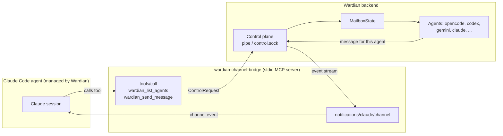

# Cross-Provider Agent Messaging Bridge

Filename: `2026-08-22-cross-provider-agent-messaging-bridge.md`

- **Status:** Proposed
- **Date:** 2026-08-22

## Context and Problem Statement

Claude Code ships cross-session messaging: a session discovers its peers with `ListAgents`
and delivers text to one by name with `SendMessage`. Discovery and same-machine transport
are entirely local — each session registers itself in a file on disk and binds a per-session
inbox socket (a named pipe on native Windows, a Unix domain socket elsewhere).

Wardian already operates a superset of that idea for agents of every provider. It owns agent
identity, lifecycle, and a durable mailbox (`MailboxState` in `src-tauri/src/state/mailbox.rs`),
and it exposes `SendMessage` over its own control plane
(`crates/wardian-core/src/control.rs`, `src-tauri/src/control.rs:730`).

The two systems do not see each other. A Claude agent's `ListAgents` shows only Claude
sessions, so an opencode, codex, or gemini agent running under Wardian is invisible to it and
unaddressable. The goal is for a Claude agent to see **every** Wardian agent regardless of
provider and message it the way it messages any other peer.

### What the platform actually supports

Verified against the Claude Code documentation on 2026-08-22:

| Capability | Status | Evidence |
| :--- | :--- | :--- |
| Post into a session's inbox socket from an external process | **Documented** | [cross-session-messaging](https://code.claude.com/docs/en/cross-session-messaging.md) — "when you want a script or hook to post into a session"; auth line `{"type":"auth","token":"<token>"}`; `CLAUDE_CODE_MESSAGING_SOCKET` / `CLAUDE_CODE_MESSAGING_TOKEN` env vars |
| The inbox socket **message frame** schema (after the auth line) | **Not documented, unverified** | Auth line and line-delimited framing are specified; the message payload shape is not published |
| Registering a non-Claude process as a peer in `ListAgents` | **Not supported** | Registry described only as "files on disk"; no format, no registration API |
| Pushing an external event into a running session | **Documented** | [channels](https://code.claude.com/docs/en/channels.md) / [channels-reference](https://code.claude.com/docs/en/channels-reference.md) — research preview |

The registry route is therefore ruled out: making a Wardian agent appear in `ListAgents`
requires writing counterfeit session files keyed to a live `pid`/`procStart` and serving an
unpublished pipe protocol. That is internal surface with no stability guarantee and it fails
silently on upgrade.

Channels close the gap from the other side. A channel **is** an MCP server, and MCP servers
already carry tool calls in the opposite direction. One server can therefore serve both
directions of the bridge.

## Relationship to Existing Issues

This spec does not propose a new subsystem. It is a consumer of one that has been planned since
2026-03-11 and a dependent of an open correctness problem.

### #57 — Internal Wardian MCP Server (open, `phase-3`, `complexity-high`)

The bridge is a slice of #57, not a parallel effort. That issue already specifies an internal MCP
server exposing `spawn_agent`, `trigger_notification`, `run_workflow`, and `access_kv_storage`,
and it already mandates the architecture this spec independently arrived at: *"The MCP server will
utilize the same underlying Rust backend logic as the wardian CLI binary."* The Rust/`rmcp`
sidecar decision above is therefore the existing plan of record, not a new choice.

Two adjustments to #57 follow from this spec:

- `wardian_list_agents` and `wardian_send_message` should join its tool set. Their absence is a gap
  in the original list — every tool there acts on the *system*, none let an agent address another
  agent.
- #57 requires that *"every MCP call should be logged to the agent's PTY history as a virtual
  command to maintain the audit trail."* This spec does not currently satisfy that. Both bridge
  tools and every inbound channel push must emit a virtual command entry, or cross-provider
  messages become the one class of agent action invisible to the audit trail.

### #872 — Causal ordering and authoritative checkpoints (open)

**This is a hard prerequisite for Direction 2 and it changes the delivery design above.**

#872 documents a real failure from a multi-agent KiCad workflow: worker updates queued behind a
busy recipient arrived out of order, a stale summary was treated as current, and the receiving
agent scheduled contradictory follow-up work. Its second finding names this spec's exact hazard —
*"Wardian conversation messages and the platform's direct sub-agent channel have no shared causal
ordering or deduplication. 'Last message received' is therefore not necessarily the latest worker
state."*

Channel push would add a **third** delivery channel to a system that already cannot reconcile two.
Shipping it without #872's envelope would not merely inherit the bug; it would widen it, and the
turn-boundary batching described above is precisely the condition under which #872 reproduces.

The `wardian_ack_message` design above is therefore necessary but not sufficient. An ack proves
receipt; it establishes no ordering. Channel pushes must carry #872's causal checkpoint envelope
in `meta`:

```ts
meta: {
  from_name: 'refactor-worker',
  from_session: '3f2a91c4',
  from_provider: 'opencode',
  task_id: 'task-118',
  turn_id: 'turn-4',
  checkpoint_seq: '7',
  checkpoint_status: 'final',
  supersedes: '5',
  source_channel: 'wardian_channel',
  message_id: 'msg-0007',
}
```

`source_channel` already appears in #872's proposed envelope, which confirms the model anticipated
additional channels. All keys are snake_case, satisfying both the channel meta-key constraint
(hyphens are silently dropped) and the project's IPC convention. The `instructions` string must
tell the model to treat a lower `checkpoint_seq` for a known `task_id` as superseded and discard
it rather than acting on it.

### Sequencing consequence

Phase 1 (tools only) introduces **no** new delivery channel — `wardian_send_message` routes through
the existing mailbox path and inherits whatever ordering semantics that path already has. It is
therefore independent of #872 and can proceed immediately.

Phase 2 (channel push) is blocked on #872. That ordering is not a scheduling preference; delivering
it first would ship a known-defective coordination path into a workflow that has already failed on
it once.

## Proposed Decision

Introduce the **Wardian Channel Bridge**: a single stdio MCP server, spawned per Claude agent,
that is simultaneously a standard tool provider (Claude to Wardian) and a Claude Code channel
(Wardian to Claude). It holds no state. It is a thin adapter between the MCP stdio transport
and Wardian's existing control plane.



Claude Code spawns the bridge as a subprocess over stdio, so **each Claude agent gets its own
bridge instance**. That instance is bound to exactly one Wardian agent identity, which removes
any need for the bridge to address or multiplex sessions itself.

### Runtime and packaging

The bridge is a **custom Wardian server**. No Anthropic-provided MCP server is involved. The
`claude/channel` key sits under `capabilities.experimental`, which is MCP's standard namespace
for vendor extensions — declaring it is how a server identifies itself as a channel, not a
reference to an external component. The official telegram, discord, imessage, and fakechat
plugins are worked examples, not dependencies.

The channels documentation names `@modelcontextprotocol/sdk` and a Node-compatible runtime as
the requirement, but that is an SDK convenience rather than a protocol constraint: a channel is
JSON-RPC over stdio with three message shapes (`tools/list`, `tools/call`, and the
`notifications/claude/channel` emit).

**Decision: implement the bridge in Rust** using `rmcp` (the official Rust MCP SDK) and ship it
as a Tauri sidecar binary. Rationale:

- Preserves the project mandate that the Rust backend is the single source of truth. A Node
  sidecar whose only job is to relay into Rust adds a runtime dependency and a serialization hop
  for no capability gain.
- The bridge can reach Wardian state directly rather than round-tripping every call through the
  control pipe.
- Avoids requiring Bun or Node on end-user machines for an otherwise self-contained Tauri app.

The cost is losing the published channel examples as copy-paste reference. That is acceptable
for a three-message protocol, but Phase 1 should validate the capability declaration against a
real Claude Code session early, since the contract is a research preview and `rmcp` has no
first-class support for the `experimental` capability namespace.

### Identity resolution

Wardian builds the launch command for the agents it manages (`mcp_config` already exists on
`AgentConfig`, `crates/wardian-core/src/models/agent_config.rs:89`), so it injects the identity
at spawn time:

| Variable | Purpose |
| :--- | :--- |
| `WARDIAN_SESSION_ID` | The Wardian agent session this bridge represents. Becomes the `origin` on every outbound control request. |
| `WARDIAN_HOME` | Resolves the control endpoint. The endpoint key is an FNV-1a hash of the home path (`control.rs:960`). |

If `WARDIAN_SESSION_ID` is absent the bridge starts in **degraded mode**: tools still work and
report the roster, but `wardian_send_message` is rejected with a clear error rather than sending
with a forged origin, and no channel notifications are emitted. This is the case for a Claude
session the user started outside Wardian and wired up by hand.

### Direction 1 — Claude to any Wardian agent (MCP tools)

Standard MCP, no preview surface, works today.

`wardian_list_agents`

```json
{
  "name": "wardian_list_agents",
  "description": "List every Wardian-managed agent across all providers, with status and workspace.",
  "inputSchema": {
    "type": "object",
    "properties": {
      "scope": { "type": "string", "enum": ["live", "all"], "default": "live" },
      "provider": { "type": "string", "description": "Optional provider filter, e.g. opencode." }
    }
  }
}
```

Maps to the control plane's agent listing. Each row returns `session_id`, `name`, `provider`,
`status`, `workspace`, and `class`, so the model can address an agent by name the way it
addresses a Claude peer.

`wardian_send_message`

```json
{
  "name": "wardian_send_message",
  "description": "Deliver a plain-text message to a Wardian agent of any provider.",
  "inputSchema": {
    "type": "object",
    "required": ["target", "message"],
    "properties": {
      "target": { "type": "string", "description": "Agent name or session_id." },
      "message": { "type": "string" },
      "thread": { "type": "string" },
      "input_mode": { "type": "string", "enum": ["prompt", "steer"] },
      "queue_policy": { "type": "string", "enum": ["queue", "replace", "reject"] }
    }
  }
}
```

Maps directly onto `ControlRequest::SendMessage`, reusing the existing delivery path
(`deliver_message_to_target_with_headless_timeout` to `MailboxState` to PTY). `origin` is set to
`MessageOrigin::WardianAgent { session_id }` from `WARDIAN_SESSION_ID`; the bridge never accepts
an origin supplied by the model.

The tool names are deliberately not `SendMessage`/`ListAgents`. Claude Code's built-ins keep
those names, and shadowing them would make it ambiguous which roster the model is addressing.
The `instructions` string tells the model that Wardian tools reach every provider while the
built-ins reach Claude sessions only.

### Direction 2 — Any Wardian agent to Claude (channel push)

The bridge declares the channel capability:

```ts
const mcp = new Server(
  { name: 'wardian', version: '0.1.0' },
  {
    capabilities: {
      experimental: { 'claude/channel': {} },
      tools: {},
    },
    instructions:
      'Messages from other Wardian agents arrive as <channel source="wardian" ...> events. ' +
      'The from_name and from_session attributes identify the sender. To reply, call ' +
      'wardian_send_message with target set to the sender from_session value. Wardian tools ' +
      'reach agents of every provider; the built-in ListAgents and SendMessage reach Claude ' +
      'sessions only.',
  },
)
```

When a Wardian agent sends to this Claude agent, the backend emits a control event and the
bridge pushes it:

```ts
await mcp.notification({
  method: 'notifications/claude/channel',
  params: {
    content: '<message body>',
    meta: {
      from_name: 'refactor-worker',
      from_session: '3f2a91c4',
      from_provider: 'opencode',
      thread: 'inbox-4821',
      message_id: 'msg-0007',
    },
  },
})
```

which the model receives as:

```text
<channel source="wardian" from_name="refactor-worker" from_session="3f2a91c4"
         from_provider="opencode" thread="inbox-4821" message_id="msg-0007">
rebasing on main is safe now; the tenant_id column landed
</channel>
```

Meta keys must be identifiers — letters, digits, and underscores only. Keys containing hyphens
are **silently dropped**, so every key above is snake_case, which matches the project's
IPC/data-model convention anyway.

Delivery lands at a turn boundary: events queue and are delivered together on the next turn.
That matches how Claude Code delivers native cross-session messages, so the semantics the model
already understands carry over.

### Acknowledgement and the mailbox lifecycle

Claude Code does not acknowledge channel notifications, and `mcp.notification()` resolves when
the bytes hit the transport, not when the model has read them. Wardian's `MailboxState` has a
real delivery lifecycle (`Pending` to `InFlight` to `Delivered`/`Failed`), so the bridge must not
mark a record `Delivered` on notification write alone — that would report delivery for a message
the session dropped.

Resolution: the bridge marks the record `InFlight` on push, and the model closes the loop by
calling `wardian_ack_message` with the `message_id` from the `<channel>` tag. The `instructions`
string asks for the ack. An unacked record past a bounded timeout reverts to `Pending` via the
existing `mark_pending` path and is retried once, then marked `Failed`. This reuses the state
machine already in `mailbox.rs` rather than adding a second notion of delivery.

## Consequences

- **Positive**: Bidirectional on documented surfaces only. No session-registry spoofing, no
  reverse-engineered pipe protocol, no reading the `.key` sidecar.
- **Positive**: One process, one config entry, both directions. The channel capability and the
  tool capability live on the same MCP server.
- **Positive**: Reuses the whole existing delivery path. The bridge adds no state, no second
  mailbox, and no new transport — it speaks to the control plane the CLI already speaks to.
- **Positive**: Wardian controls the launch command for the agents it manages, so the preview
  flags and `.mcp.json` wiring are absorbed by the app and never surface to the user.
- **Positive**: Gives the stubbed `mcps` library section its first real consumer
  (`crates/wardian-core/src/library/index.rs:78`, currently `reject_mcps`).
- **Negative**: Channels are a **research preview**. The `--channels` flag syntax and the
  protocol contract may change, and custom channels are not on the Anthropic-curated allowlist,
  so managed Claude agents must launch with
  `--dangerously-load-development-channels server:wardian` until a Wardian channel is allowlisted.
  This is a real upgrade-breakage risk and the bridge must degrade to tools-only cleanly.
- **Negative**: Channels require Anthropic authentication (claude.ai or a Console API key) and
  are unavailable on Amazon Bedrock, Google Cloud's Agent Platform, and Microsoft Foundry.
  Direction 2 is unavailable for agents on those providers; direction 1 still works.
- **Negative**: Team and Enterprise organizations must set `channelsEnabled` in managed settings.
  Pro and Max personal accounts skip that check. Without it the MCP server still connects and its
  tools work, but pushed events never arrive — a silent partial failure the bridge should detect
  and surface at startup.
- **Negative**: Asymmetric addressing. Claude agents address Wardian agents through
  `wardian_send_message`, not the built-in `SendMessage`. The roster is unified; the call is not.
- **Negative**: Claude sessions the user starts outside Wardian need manual `.mcp.json` wiring
  and the launch flag; they cannot be auto-enrolled.

## Edge Cases

- **Non-Claude providers**: opencode, codex, and gemini have no channel mechanism. They keep
  receiving through the existing mailbox to PTY path. The bridge changes nothing for them.
- **Message loops**: two agents can ping-pong. Wardian must apply its own per-sender rate limit
  and identical-repeat suppression on the channel push path; Claude Code's native loop throttling
  does not cover channel events.
- **Size**: Wardian should cap channel `content` well below Claude Code's ~1M character
  cross-session limit and truncate with an explicit marker rather than letting the model receive
  a silently clipped body.
- **Ordering**: events are delivered in order but batched into a single turn. A burst of messages
  from several agents arrives as one group, so each event must be self-describing via `meta` — the
  model cannot rely on turn boundaries to separate senders.
- **Bridge death**: if the bridge subprocess exits, Claude Code loses both directions. Queued
  Wardian messages stay `Pending` and are pushed when a new bridge instance attaches.
- **Filesystem boundaries**: a session inside WSL 2 or a container and a native Windows session
  register under different homes and cannot see each other. The bridge is unaffected — it reaches
  Wardian over the control endpoint, not the Claude registry — but the native `ListAgents` roster
  will differ from the Wardian roster in those setups, which the `instructions` string should note.
- **Degraded mode**: no `WARDIAN_SESSION_ID`, no `channelsEnabled`, or a bridge started without
  the development flag must all fail loudly at startup and fall back to tools-only rather than
  appearing to work.

## Prior Art: cmux

`manaflow-ai/cmux` is the closest comparable — a terminal multiplexer that runs many coding
agents in parallel across 17 providers. Reviewed at commit `e77660d`. The useful finding is
negative: **cmux implements no inter-agent messaging whatsoever.** No roster, no addressing, no
inbox, no broker. Its ~180 CLI commands and its Rust rewrite's 103-command schema contain no
send-message verb. Agent-to-agent communication is left entirely to the provider.

What it does instead is impersonate tmux — it writes a fake `tmux` onto `PATH`, fabricates
`TMUX`/`TMUX_PANE`, and translates tmux verbs into its own socket RPCs, so Claude Code's native
agent-teams feature believes it is running under a supported multiplexer. Addressing is
topological (window → workspace → pane → surface), never agent identity. Cross-provider
"messaging" is therefore literally: write bytes into the other agent's PTY and poll its screen.

Four conclusions bear directly on this spec.

**1. The impersonation approach fails exactly the way we predicted.** Claude Code 2.1.183 changed
the shape of a respawn command and cmux's teammate panes silently stopped opening (cmux #6447).
A separate open bug (#8129) has the shim return exit 0 while killing the spawned process, so
Claude registers a teammate that never exists and waits forever. This is the concrete cost of
building on an unpublished contract, and it independently confirms rejecting the
`~/.claude/sessions/` registry route.

**2. Mint the session ID; never discover it.** cmux generates the UUID itself and passes
`--session-id` to `claude` before launch, binding it to a durable surface id. Its design doc is an
explicit repudiation of the alternative — title-string matching and newest-file-by-mtime scanning
both shipped, both were wrong, and both were deleted. Wardian should mint provider session IDs at
spawn rather than inferring them, and bind on an id that is persisted and rehydrated verbatim.
Identity resolution should keep a layered fallback (explicit flag → inherited env → controlling
tty → process tree) so an agent started by hand still binds.

**3. Control state and message content belong on separate channels.** cmux reconstructs all agent
lifecycle state from a hook channel running parallel to the PTY, under the rule *push is
best-effort, pull is authoritative*, with a monotonic version on each record. This spec's channel
push is best-effort by construction (no acknowledgement), so the same rule applies: the mailbox
record in `MailboxState` is authoritative and the push is a hint. That is what the
`wardian_ack_message` design above already encodes.

**4. PTY injection is a fallback tier, not a design.** cmux's inbound path is the argument against
itself: clear the line editor with three control keys, bracketed-paste the body, then pick a
submit key that depends on both the provider and whether the text is multi-line (Claude needs
`ctrl+enter` for multi-line; bare `return` otherwise), then answer permission pickers with digit
keys that need a trailing carriage return for Codex but not for Claude. It is a per-provider TUI
dialect with no delivery semantics, and it is precisely why all lifecycle state had to be rebuilt
out-of-band.

This last point sharpens an assumption in this spec. Non-Claude providers are described above as
"keep using the existing mailbox to PTY path," which accepts exactly the fragility cmux paid for.
Several providers expose a structured control plane that is strictly better:

- **Codex**: `codex app-server`, JSON-RPC over NDJSON stdio, with real thread ids, parent links,
  and spawn depth.
- **opencode, gemini, and Claude Code itself**: the Agent Client Protocol (`opencode acp`,
  `gemini --experimental-acp`, `claude-code-acp`), also stdio NDJSON JSON-RPC.

A follow-up spec should evaluate ACP as the inbound transport for non-Claude Wardian agents,
demoting PTY injection to the escape hatch for providers that offer nothing structured. That is
out of scope here — this spec covers the Claude side — but it is the natural sequel and it would
replace the weakest remaining link in Wardian's delivery path.

## Alternatives Considered

- **Write counterfeit `~/.claude/sessions/<pid>.json` entries and serve `cc-msg-*` pipes.**
  Would deliver true `ListAgents` parity — a Wardian agent indistinguishable from a Claude peer.
  Rejected: the registry schema, the pipe framing, and the `.key` auth are all undocumented
  internals with no stability guarantee, and the entries are validated against a live process.
- **Post directly into each Claude agent's documented inbox socket.** Legitimate and documented
  for the auth handshake, and the token is obtainable from a `SessionStart` hook rather than the
  key file. Rejected as the primary mechanism because the message frame schema after the auth line
  is unpublished and could not be verified empirically. Worth revisiting if the frame is
  documented; it would give direction 2 without the research-preview dependency.
- **Long-polling MCP tool (`wardian_await_message`).** Pure MCP, no preview surface. Rejected as
  primary: it consumes a turn, only drains when the model chooses to call it, and cannot deliver
  while the agent is working. Retained as the **fallback for direction 2** when channels are
  unavailable (Bedrock/Vertex/Foundry, or `channelsEnabled` unset).

## Rollout

1. **Phase 1 — tools only.** Ship `wardian_list_agents` and `wardian_send_message` as the first
   slice of #57. No preview dependency, no new delivery channel, not blocked on #872. Claude
   agents can address every provider immediately.
2. **Phase 2 — channel push. Blocked on #872.** Add the channel capability, the causal checkpoint
   envelope, `wardian_ack_message`, and the `--dangerously-load-development-channels` wiring in
   the managed launch command.
3. **Phase 3 — fallback.** Add `wardian_await_message` for environments where channels cannot run.
4. **Phase 4 — upstream.** File a feature request for a documented peer-registration extension
   point, and apply for channel allowlisting to drop the development flag.

## Verification

- Rust unit tests for the control-request mapping and origin enforcement.
- Native E2E is required for the end-to-end path: the bridge spawns a real subprocess and drives
  real IPC, which browser E2E cannot prove (see the E2E layer boundary rules in `AGENTS.md`).
- A real-provider E2E run covering a Claude agent messaging an opencode agent and receiving the
  reply as a `<channel>` event.

## References

- [Cross-session messaging](https://code.claude.com/docs/en/cross-session-messaging.md)
- [Channels](https://code.claude.com/docs/en/channels.md)
- [Channels reference](https://code.claude.com/docs/en/channels-reference.md)
