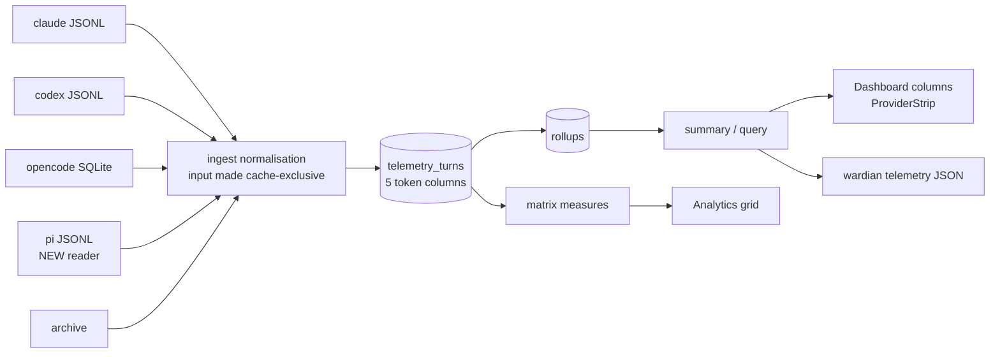

# Cache Token Accounting

- **Status:** Implemented
- **Date:** 2026-08-25

## Context and Problem Statement

The telemetry store already ingests a five-way token split for every turn
(`TurnFact`, `crates/wardian-core/src/telemetry/models.rs`). Two of those five
never reach a total:

- **`cached_input_tokens`** is excluded from every total on purpose, and is
  plottable on its own as the `cached_tokens` measure.
- **`cache_write_tokens`** is stored by every native source and surfaced
  **nowhere**. It has no `Measure` variant, no Dashboard column, and no place in
  `TokenCounts::billable_total()`.

That second one is not a presentation gap. Cache writes are prompt content the
model read for the **first** time, billed at or above the fresh-input rate. On
the real 400-turn claude session pinned in
`crates/wardian-core/tests/telemetry_real_claude_log.rs`:

| Component | Tokens | In today's "Tokens" figure? |
|---|---:|---|
| Fresh input | 8,446 | yes |
| **Cache write** | **1,885,871** | **no** |
| Cache read | 80,194,623 | no (deliberate) |
| Output | 462,954 | yes |

`billable_total()` reports **471,400**. New content actually processed was
**2,357,271**. The Dashboard understates that session **5.0x**, and hides
**99.6%** of its fresh prompt content, because Claude Code writes nearly all
new context into the cache rather than sending it as plain input.

The prompting question was whether to follow ccusage and fold cache into the
default count. Summing all four for that session gives 82,551,894 — 175x the
current figure, with 97% of it cache reads. Both figures are wrong. The
correction is to move cache **writes** in and keep cache **reads** out.

Auditing the same question across every provider surfaced a second, larger gap:
**pi has no telemetry source at all**, despite reporting richer usage data than
any provider that does. That is covered in nuance 5 below and sequenced ahead of
the total's redefinition.

## Provider Ground Truth

Every decision below depends on what each source actually reports. These are
verified against the adapters and committed fixtures, not assumed.

| | claude | codex | opencode | **pi** | antigravity / gemini |
|---|---|---|---|---|---|
| Source | JSONL, byte cursor | JSONL, byte cursor | SQLite, epoch cursor | JSONL, byte cursor | Wardian archive |
| Ingested | yes | yes | yes | **no → yes, added here** | yes (activity only) |
| `input_tokens` | already cache-exclusive; **stored raw** | **inclusive** of cache reads; source subtracts, clamped at 0 | already disjoint; stored raw | already disjoint | not reported |
| Cache read field | `cache_read_input_tokens` | `cached_input_tokens` | `tokens.cache.read` | `usage.cacheRead` | — |
| Cache write field | `cache_creation_input_tokens` | `cache_write_input_tokens` | `tokens.cache.write` | `usage.cacheWrite` | — |
| Cache write observed | large and routine (1.89M over 400 turns) | **always 0** in every fixture record | 0 in fixture; provider-dependent | 0 in all observed records (OpenAI-backed route) | — |
| Reasoning | not reported (billed as output) → `None` | `reasoning_output_tokens`, a **subset of output** | `tokens.reasoning` | `usage.reasoning`, a **subset of output** | — |
| Native cost | none | none (reports rate-limit headroom instead) | real per-message `cost` (scalar) | **real per-component `cost`** | none |
| Model identity | `model` | `model` | `modelID` only | **`api` + `provider` + `model`** | — |
| Provider total invariant | `input + write + read + output` | `input + output` (write excluded) | `total = input + output + read + write` | `totalTokens = input + output + cacheRead` | — |

Five nuances follow from this table and constrain everything downstream.

**1. Cache writes are only meaningful for claude today.** Codex emits
`cache_write_input_tokens: 0` on every record in `codex-rollout.jsonl`, and
codex's own `total_tokens` excludes the field entirely. OpenAI does not bill
prompt-cache writes, so this is expected to stay 0. A cache-write measure will
therefore look claude-only on most habitats. That is a correct reading of
reality, not a defect to paper over.

**2. Codex's write-versus-input disjointness is unverifiable from data.**
Because codex's cache write is always 0, no fixture can prove whether a
hypothetical nonzero value would be inside `input_tokens` (and thus already
inside `fresh = input - cached`) or outside it. If codex ever starts reporting
writes and they are inclusive, a processed total would double count them. This
must be guarded, not hoped about — see [Invariants and Tests](#invariants-and-tests).

**3. Reasoning must never be added to any total.** For codex, reasoning is a
subset of output: the fixture record reads `input 100,544 + output 254 =
total 100,798` with `reasoning_output_tokens: 44` sitting inside the 254.
Claude stores `None`. A "sum everything" total would double count reasoning for
exactly one provider.

**4. Opencode's `model` is not a globally unique pricing key.** The source
stores `modelID` alone; opencode's own identity is `providerID/modelID`, and
`providerID` is discarded at ingest. `deepseek-v4-flash-free` routed through two
different providers prices differently. This is one of two things that make a
USD column infeasible today, and something Phase 2 must fix.

**5. Pi had the best token accounting of any provider and contributed none of
it.** Before this change, `source_for` in `sources/mod.rs` matched only `codex`,
`claude`, and `opencode`, and `uses_archive` was an allow-list of
`antigravity | gemini`. So `is_supported("pi")` was false and the ingest loop
skipped every pi agent outright — not even the archive fallback that covers
antigravity. Pi agents were invisible to the Dashboard, Analytics, and the CLI.

That is expensive, because pi already writes everything this spec wants. From a
real session under `~/.wardian/agents/<id>/pi/sessions/*.jsonl`, an assistant
message carries:

```json
{"role":"assistant","api":"openai-codex-responses","provider":"openai-codex",
 "model":"gpt-5.6-luna",
 "usage":{"input":2177,"output":7,"cacheRead":7680,"cacheWrite":0,"reasoning":0,
          "totalTokens":9864,
          "cost":{"input":0.0004354,"output":0.0000084,
                  "cacheRead":0.0001536,"cacheWrite":0,"total":0.0005974}}}
```

Three properties follow, each checked against the observed records:

- **`input` is cache-exclusive.** `2177 + 7 + 7680 = 9864` matches
  `totalTokens`, so cache reads sit outside `input`. Pi needs the claude and
  opencode treatment (store raw), not codex's subtraction.
- **`reasoning` is a subset of output.** Records with `reasoning: 35` and
  `reasoning: 63` reconcile as `input + output = totalTokens` with the reasoning
  figure nowhere in the sum, and `cost` carries no reasoning line at all.
- **Cost is decomposed per component, and the model is fully qualified.**
  `cost.total` equals the sum of its four components exactly. Dividing cost by
  tokens recovers the rates directly: $0.20/Mtok input, $1.20/Mtok output,
  $0.02/Mtok cache read — a clean 0.1x read multiplier — consistent across every
  observed record.

Caveats on scope: this is three usage records from one session, all on an
OpenAI-backed route, so every observed `cacheWrite` is 0. Pi's cache-write
behaviour on an Anthropic route is unobserved, and whether `cacheWrite` is
additive to `totalTokens` is untestable from this data — the same gap codex has
in nuance 2, and it needs the same tripwire.

## Proposed Decision

### 1. Cache reads stay out of every total — reaffirmed

No change. The existing rationale holds and the numbers above strengthen it:
cache reads are 97% of that session's tokens and would swamp every other row.
`cached_tokens` remains available as its own measure for anyone who wants it.

### 2. Cache writes enter the processed total

Rename and redefine:

```
TokenCounts::billable_total()  ->  TokenCounts::processed_total()
    = fresh input + cache write + output
```

`None` when none of the three components was reported, preserving the existing
unreported-is-not-zero contract. The rename is deliberate: "billable" was always
inaccurate, because cache reads are billed too, just at a tenth of the input
rate. "Processed" says what the figure counts — content the model handled for
the first time — and is true for every provider in the table.

The matching SQL in `matrix.rs` and `query.rs` changes in lockstep:

```sql
-- Measure::TotalTokens
COALESCE(SUM(input_tokens), 0)
  + COALESCE(SUM(cache_write_tokens), 0)
  + COALESCE(SUM(output_tokens), 0)
```

The `CASE` in `query.rs` that mirrors `billable_total`'s NULL behaviour must be
extended to consider `cache_write_tokens` in its `COUNT` guard, or a
claude-shaped provider that reported only writes would read as unreported.

### 3. Two new measures

- **`cache_write_tokens`** — "Cached input written". Prompt tokens stored into
  the provider's cache for later reuse. Counted once, as fresh work.
- **`cache_hit_rate`** — `cache_read / (fresh + write + read)`, as a percentage.
  A ratio, so it is **not summable across buckets or rows** and must be flagged
  the way `is_distinct_count` already flags `Turns` and `Files`; the matrix
  needs a separate `is_ratio` predicate, because a distinct count and a ratio
  are unsummable for different reasons and a row total must recompute the ratio
  from its own components rather than average the cells.

`cacheReadRatio()` in `telemetryFormat.ts` currently divides cache reads by
fresh input alone, which on the claude session above yields 9,494x — a number
whose only real content is "claude barely uses plain input". Redefining it
against the full prompt makes it a bounded percentage that means the same thing
for every provider.

### 4. A pi telemetry source, sequenced first

Pi is the only supported provider with no reader at all, and it is the easiest
of the four to write: append-only JSONL with a `{"type":"session","id":...}`
header, advanced by byte offset, with usage on `type: "message"` records whose
`message.role` is `assistant`. It maps onto the existing `TelemetrySource`
trait with no new machinery — the same shape as the claude reader, and unlike
codex it needs no subtraction.

`PiSource` stores `usage.input` raw, `cacheRead` → `cached_input_tokens`,
`cacheWrite` → `cache_write_tokens`, `output` → `output_tokens`, and `reasoning`
→ `reasoning_tokens` (recorded, never summed, per nuance 3). `cost.total` goes
to `cost_usd`. Registration is two lines: a `"pi" =>` arm in `source_for` and
`is_supported` follows.

This lands **before** the total is redefined, so that the change to
`processed_total` is observable on pi's data rather than retrofitted onto it.

### 5. No USD cost measure in this change

`matrix.rs` already records why cost is absent: only opencode reports it. That
reasoning stands, and nuance 4 above adds a second, harder blocker. Phase 2 is
specified below rather than attempted here.

## Surfaces Changed



No schema migration. `telemetry_turns` and the rollup tables already carry
`cache_write_tokens`; only the read expressions and the surfaces change.

| File | Change |
|---|---|
| `crates/wardian-core/src/telemetry/sources/pi.rs` | **new** — JSONL reader, byte cursor |
| `crates/wardian-core/src/telemetry/sources/mod.rs` | register `"pi"` in `source_for` |
| `crates/wardian-core/src/telemetry/models.rs` | `billable_total` → `processed_total`, add cache write |
| `crates/wardian-core/src/telemetry/matrix.rs` | `TotalTokens` expression; add `CacheWriteTokens`, `CacheHitRate`; add `is_ratio` |
| `crates/wardian-core/src/telemetry/query.rs` | series `CASE` guard extended to cache writes |
| `crates/wardian-cli/src/telemetry.rs` | JSON key `billable_tokens` → `processed_tokens` (**breaking**; needs a changelog line) |
| `src-tauri/src/commands/telemetry.rs` | DTO field rename, four call sites |
| `src/features/telemetry/telemetryTypes.ts` | field rename; two new measure ids |
| `src/features/telemetry/telemetryFormat.ts` | measure options and hints; `cacheReadRatio` denominator |
| `src/features/telemetry/dashboardColumns.ts` | line 113 hint — "Billable tokens in the window — fresh input plus output" is wrong twice over |
| `docs/guide/`, `docs/developer/` | the token glossary |

## Invariants and Tests

Each of these is a named test, not a comment.

1. **`cache_writes_reach_the_processed_total`** — the claude real-log fixture
   totals 2,357,271, not 471,400.
2. **`cache_reads_stay_out_of_the_processed_total`** — the same fixture does not
   produce 82,551,894.
3. **`codex_cache_writes_are_disjoint_from_its_input`** — guards nuance 2.
   Assert `cache_write_input_tokens == 0` across the codex fixture. When it
   stops being zero this test fails, which is the intended alarm: someone must
   then confirm against a real rollout whether codex's `input_tokens` contains
   the write before the processed total can trust it.
4. **`opencode_components_still_reconcile`** — `total == input + output +
   read + write` on the fixture. Opencode routes arbitrary upstreams through the
   AI SDK, so its disjointness is a normalisation promise by a third party, not
   a format guarantee. This is the tripwire.
5. **`reasoning_is_never_added_to_a_total`** — codex fixture: the processed
   total must not move when `reasoning_output_tokens` is nonzero.
6. **`archive_providers_report_unreported_not_zero`** — every new measure is
   `None` for antigravity and gemini, and `tokens_reported` stays false.
7. **`the_hit_rate_is_recomputed_for_row_totals`** — a row whose buckets have
   different hit rates must total to the component-derived rate, not the mean of
   the cells.
8. **`pi_input_is_already_cache_exclusive`** — `totalTokens == input + output +
   cacheRead` on a committed pi fixture, which is the evidence that pi is stored
   raw rather than subtracted. Mirrors the existing opencode test.
9. **`pi_cache_writes_are_disjoint_from_its_total`** — the pi analogue of test 3.
   Every observed record has `cacheWrite: 0` on an OpenAI-backed route, so this
   asserts that and fails loudly the first time an Anthropic-routed pi session
   reports a nonzero write, before the processed total can trust it.
10. **`pi_reasoning_stays_inside_output`** — `input + output == totalTokens` on a
    record with nonzero `reasoning`, and `cost` carries no reasoning component.
11. **`pi_costs_reconcile_to_their_components`** — `cost.total` equals the sum of
    `cost.input + output + cacheRead + cacheWrite`. This is the assertion Phase 2's
    price oracle rests on, and it is worth pinning before anything depends on it.

## Phase 2: Weighted Cost (Not In This Change)

Recorded because the "should we count cache" question is ultimately about
spend, and the honest answer is that **no token count answers it**. Priced at
Sonnet list rates, that same claude session breaks down as roughly $0.03 fresh
input, $7.07 cache writes, $24.06 cache reads, $6.94 output — about $38. Cache
reads are 97% of the tokens and still 63% of the bill. A measure that excludes
them is right about work and wrong about money; one that includes them raw is
wrong about both.

A cost measure is therefore worth building, and pi changes its feasibility
substantially. Three prerequisites:

1. **Store the qualified model key.** Pi already reports `provider` + `model` +
   `api` per message; opencode discards `providerID` and must stop. Both feed
   one `provider/model` key.
2. **A price table keyed on `provider/model`** with an explicit *unpriced*
   state. An unknown model must render as unpriced, never as $0 — the same
   unreported-is-not-zero rule the token columns already follow.
3. **Derive and validate rates against pi, then opencode.** Pi is the better
   oracle of the two and was the missing piece: it reports cost **per
   component**, so each rate can be recovered by division rather than
   transcribed from a vendor page — the observed session yields $0.20/Mtok
   input, $1.20/Mtok output, and a 0.1x cache-read multiplier for
   `openai-codex/gpt-5.6-luna` with no external lookup. Opencode's scalar
   `cost` then checks the assembled table end to end. A computed cost that
   cannot reproduce either provider's own figure within tolerance is a table
   bug, and both tests can be written before a single price is hand-entered.

The honest limit: pi and opencode only self-price the models *they* route.
Claude and codex report no cost, so their rates still have to be maintained by
hand, and the oracle proves the *arithmetic* rather than those numbers.

Anthropic's 5-minute and 1-hour cache writes price at 1.25x and 2x input.
`claude.rs` reads the aggregate `cache_creation_input_tokens` and discards the
`ephemeral_5m` / `ephemeral_1h` split. That is correct for a count and
insufficient for a price, so Phase 2 also needs the split captured at ingest.

## What Implementation Changed

Three things the spec did not predict, found while building it.

**Pi reports the Anthropic cache-TTL split.** Pi's `Usage` type carries
`cacheWrite1h`, documented as "subset of `cacheWrite` written with 1h
retention. Only Anthropic reports this split." Phase 2 named that split as
something `claude.rs` discards and would have to start capturing; pi supplies it
already. No column exists for it yet, so it is deliberately not stored — noted
here so Phase 2 does not go looking for it in the wrong place.

**Pi's stream and its session file disagree about what `usage` means.** Pi's
`--mode json` stream carries a top-level `usage` its own docs call "the latest
cumulative provider-reported usage". The session file persists an
`AssistantMessage`, whose `usage` covers that message alone. Reading the
cumulative one as a delta would multiply a session's tokens by roughly its
message count, and every figure would stay plausible while doing it — the exact
failure mode of the codex 49-fold error. The parser reads the session file and
says so; upstream's own type definition confirms `reasoning` is "a subset of
`output`", which the spec had inferred from arithmetic alone.

**The hit rate needed a surface flag, not just a SQL expression.** `Matrix`
already carried `cells_are_not_additive` for distinct counts. A ratio is
unsummable for a different reason but has the same consequence for a reader, so
the flag is now `is_distinct_count() || is_ratio()`. Row totals were already
computed by a separate query rather than by summing cells, so the ratio is
correct over any group it is given without further work.

Labels came out shorter than the spec proposed: the measure selector caps short
labels at nine characters, so `cache_write_tokens` is "Cache writes" / "Written"
rather than "Cached input written".

## Prior Art

**ccusage** prints the four components as separate columns plus an unweighted
grand total, and prices each component separately for its cost figure. The
separate columns are right and Wardian already has them; the grand total is
addressed under Rejected Alternatives.

**CodexBar** answers a different question, and the difference is instructive.
Its changelog states that "cached usage derives from the larger of
`cached_input_tokens`/`cache_read_input_tokens`" — it reads codex's and claude's
field names and takes whichever the provider populated, keeping cached tokens as
a **separate** tracked quantity rather than folding it into one total. So on the
narrow question, CodexBar agrees with the decision here: cache reads are their
own figure. Its cache-write handling is not documented.

Two contrasts matter:

- **It latches a watermark on a cumulative gauge**, detecting out-of-order
  `token_count` events "field-level before watermark latching". Wardian sums
  per-call deltas from `last_token_usage` and reconciles them against codex's
  cumulative `total_token_usage` in `telemetry_real_codex_log.rs`. Both are
  defensible; latching is more robust to a missed delta, delta-summing is the
  only one that can attribute tokens to a *turn*, which is what a rows × time
  matrix requires. No change proposed.
- **It is a limit tracker, not an analytics store.** Its headline is percent of
  cap and time to reset, read from the provider rather than computed from tokens
  at all. A cap percentage and a work total answer different questions and
  cannot be derived from each other, so the two stay separate here.

  This is already settled ground. [Dashboard Provider Activity
  Strip](2026-08-20-dashboard-provider-activity-strip.md) cut per-provider
  account limits for lack of honest data, and recorded that CodexBar gets its
  Claude gauge from an OAuth usage endpoint — a network dependency, a credential
  path, and an undocumented endpoint, which is why CodexBar can show something a
  local-log telemetry store cannot. That decision is not reopened here. Note
  only that its stated next step — widen the codex limit parser, which today
  reads `primary` and discards `secondary`, `credits`, `individual_limit`, and
  `spend_control_reached` — is free, local, and independent of everything in
  this spec.

## Rejected Alternatives

**Sum all four components into the default count (ccusage's grand total).**
The weakest number in that output: two sessions with identical totals can differ
~10x in cost depending on hit rate. Adopting it would reintroduce exactly the
distortion the ingest-time normalisation was written to prevent — a raw prompt
total once overstated a real habitat 49-fold. Note that CodexBar, working the
same logs, does *not* do this either.

**Leave pi unsupported until it asks for attention.** Pi is a first-class
provider everywhere else in the app — factory, headless, readiness, workflow
assignment — and reports better usage data than any provider that *is* ingested.
Every pi agent currently renders as having done no work, which is the same
unreported-versus-zero failure this file argues against in every other section.

**Leave `cache_write_tokens` unsurfaced.** This is the status quo, and it makes
the Dashboard's headline figure wrong by 5x for the provider most Wardian agents
run on. There is no reading under which cache writes are not work performed.

**Keep the name `billable_total`.** The word is load-bearing and false. Cache
reads are billed. Keeping it guarantees the next reader re-asks this question.

**Show a per-component stacked column instead of one total.** Better
information density, but the Dashboard's total column is also the sort key and
the bar visual, both of which need a scalar. Worth revisiting for Analytics,
where the measure selector already gives the reader the components one at a
time.
